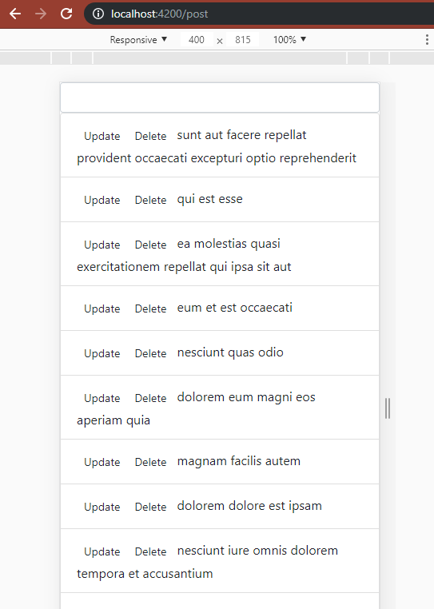

**Praktikum – Bagian 1: Configure the routers**

1.  Membuka app.module.ts menambahkan declarasi

    

2.  Menambahkan module router

1.  Menambahkan navbar pada navbar.component.html

    

2.  Hasil

    

**Praktikum – Bagian 2: Router Outlet**

1.  Memodif app.component.html

    

2.  Hasil inspect elemen

    

3.  Hasil localhost:4200/form

    

4.  Menjalankan localhost:4200/post

    

5.  Menjalankan localhost:4200/coba

    

**Praktikum – Bagian 3: Add link**

1.  Memodifikasi program navbar

    

2.  Hasil

1.  Memodifikasi href menjadi router link ada navbar

    

2.  Hasil

    

3.  Memodifikasi class li pada navbar

    

**Praktikum – Bagian 4 : Accesing Router Parameter**

1.  Membuat component profile

    

2.  Menambahkan pada app.module.ts

    

3.  Modifikasi halaman [home.component.html](http://home.component.html)

    

4.  Memodifikasi file profile.component.ts

1.  Hasil pada elemen

    

2.  Memodifikasi file profile.component.ts

    

3.  Hasil

    
