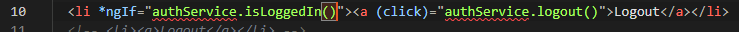
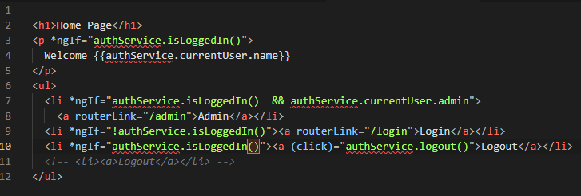

**Praktikum Authenticationdan Authorization**

1.  Install angular2-awt

    

2.  Hasil dari auth-demo-starter

    

3.  Menambahkan perintah di auth.service.ts

    

4.  Login dengan <mosh@domain.com>

    

5.  Melakukan perubahan di auth.service.ts

    

6.  Menambahkan kode di [home.component.ts](http://home.component.ts)

    

7.  Memodifikasi logout

    

8.  Membuat token baru di <https://jwt.io>

    

    

Merubah token

1.  Menambahkan kode berikut

    

2.  Memodifikasi [home.component.html](http://home.component.html)

    
