1.  Melakukan eksekusi pada angular dengan perintah ng serve --open

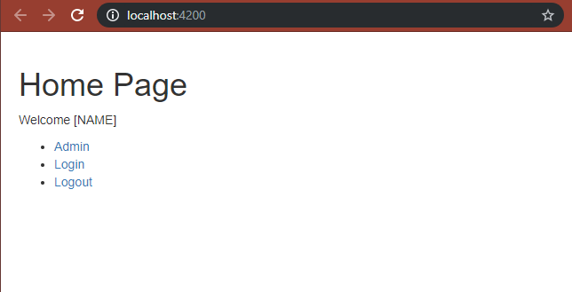

1.  Menjalankan perintah node_modules/.bin/ngc

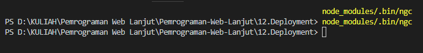

1.  Memodifikasi file environments.ts dengan menambahkan kode berikut

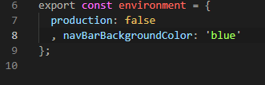

1.  Lalu memodifikasi file environment.prod.ts seperti dibawah ini

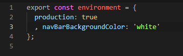

1.  Lalu memodifikasi navbar.component.ts dengan menambahkan kode
    backgroundColor

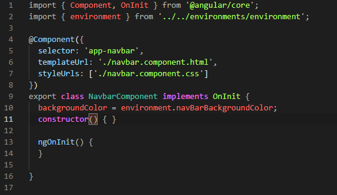

1.  Menambahkan style.backgroundColor pada navbar.component.html

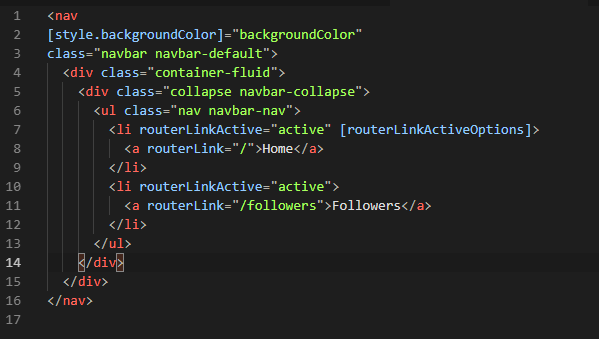

1.  Hasil setelah memodifikasi

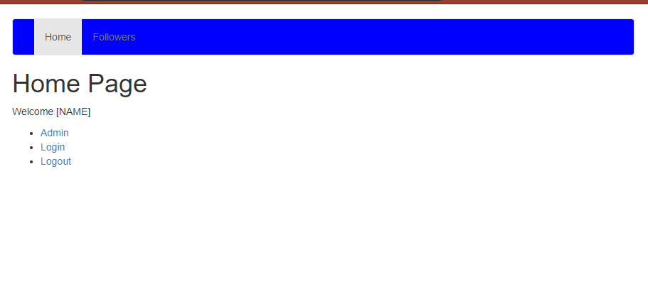

1.  Menambahkan environments pada angular-cli.json

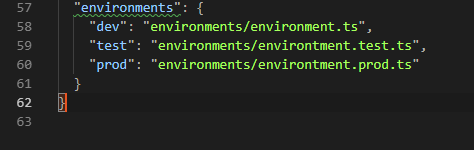

1.  Hasil setelah penambahan

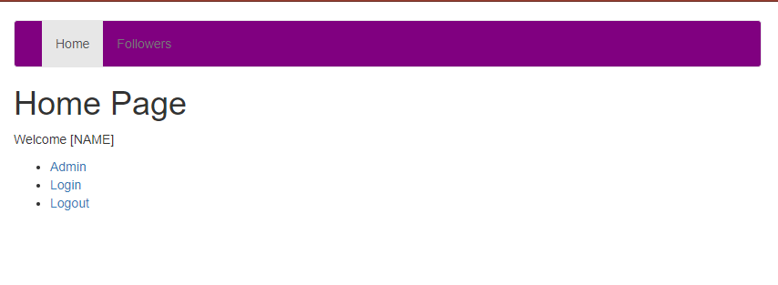

1.  Melakukan build environment

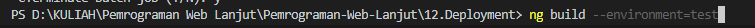

1.  Menjalankan program environment

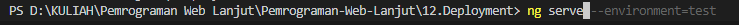

1.  Hasil

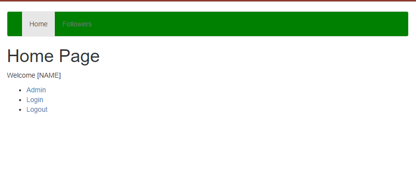
