Jobsheet 2
==========

**Praktikum – Bagian 1: instalasi Typescript**

1.  Melakukan installasi typescript dengan perintah :

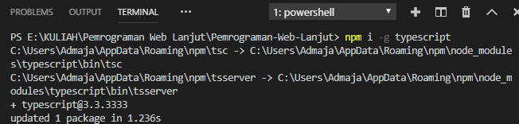

1.  Mengecek versi dari typescript

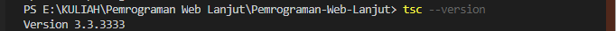

1.  Membuat direktori ts-hello

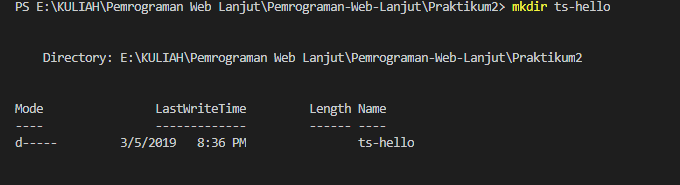

1.  Membuat code typescript

-   1.  function log(message){  
    2.  console.log(message);  
    3.  }  
    4.  let message = 'Hello World';  
    5.  log(message);

1.  melakukan proses transpile file typescript ke javascript

1.  mengecek apakah sudah ada main.js

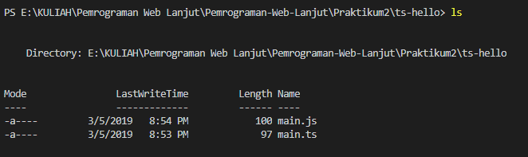

1.  melakukan execute pada file main.js

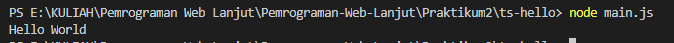

**Praktikum – bagian 2: Declaring Variable**

~~~~~~~~~~~~~~~~~~~~~~~~~~~~~~~~~~~~~~~~~~~~~~~~~~~~~~~~~~~~~~~~~~~~~~~~~~~~~~~~
1.  function doSomething(){
2.      for(let i = 0; i \< 5; i++){
3.          console.log(i);
4.      }
5.      console.log('Finally: ' +i);
6.  }
7.  doSomething();
~~~~~~~~~~~~~~~~~~~~~~~~~~~~~~~~~~~~~~~~~~~~~~~~~~~~~~~~~~~~~~~~~~~~~~~~~~~~~~~~

1.  menghapus main.js

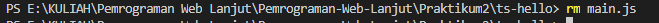

1.  mentranspile main.ts yang baru

1.  mengexecute main.js

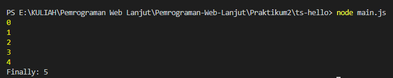

**Praktikum – bagian 3 : types**

~~~~~~~~~~~~~~~~~~~~~~~~~~~~~~~~~~~~~~~~~~~~~~~~~~~~~~~~~~~~~~~~~~~~~~~~~~~~~~~~
   1. let count = 5;
   2. count = 'a';
~~~~~~~~~~~~~~~~~~~~~~~~~~~~~~~~~~~~~~~~~~~~~~~~~~~~~~~~~~~~~~~~~~~~~~~~~~~~~~~~

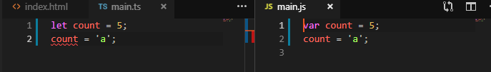

**Praktikum – bagian 4: Type Assertion**

~~~~~~~~~~~~~~~~~~~~~~~~~~~~~~~~~~~~~~~~~~~~~~~~~~~~~~~~~~~~~~~~~~~~~~~~~~~~~~~~
    1. let pesan;
    2. pesan = 'abc';
    3. let percobaan=(\<string\>pesan).endsWith('c');
    4. let alternative = (pesan as string).endsWith('c');
~~~~~~~~~~~~~~~~~~~~~~~~~~~~~~~~~~~~~~~~~~~~~~~~~~~~~~~~~~~~~~~~~~~~~~~~~~~~~~~~

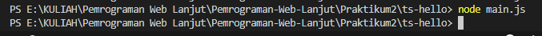

**Praktikum – bagian 5 : Arrow Function**

**Main.tsc**

~~~~~~~~~~~~~~~~~~~~~~~~~~~~~~~~~~~~~~~~~~~~~~~~~~~~~~~~~~~~~~~~~~~~~~~~~~~~~~~~
    1. let log = function pesan(){
    2.      console.log(pesan);
    3. }
    4. let doLog=(pesan)=\>{
    5.    console.log(pesan);
    6. }
    7. let doLog1=(pesan)=\>console.log(pesan);
~~~~~~~~~~~~~~~~~~~~~~~~~~~~~~~~~~~~~~~~~~~~~~~~~~~~~~~~~~~~~~~~~~~~~~~~~~~~~~~~

**main.js**

~~~~~~~~~~~~~~~~~~~~~~~~~~~~~~~~~~~~~~~~~~~~~~~~~~~~~~~~~~~~~~~~~~~~~~~~~~~~~~~~
var log = function pesan() {
    console.log(pesan);
};
var doLog = function (pesan) {
    console.log(pesan);
};
var doLog1 = function (pesan) { return console.log(pesan); };
~~~~~~~~~~~~~~~~~~~~~~~~~~~~~~~~~~~~~~~~~~~~~~~~~~~~~~~~~~~~~~~~~~~~~~~~~~~~~~~~

**Hasil execute**

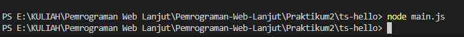

**Praktikum Bagian 6: Interface**

**Main.ts**

~~~~~~~~~~~~~~~~~~~~~~~~~~~~~~~~~~~~~~~~~~~~~~~~~~~~~~~~~~~~~~~~~~~~~~~~~~~~~~~~
interface Point{
    x:number;
    y:number;
}
let drawPoint=(point:Point)=\>{
*//...*
}
drawPoint({
    x:1,
    y:3,
})
~~~~~~~~~~~~~~~~~~~~~~~~~~~~~~~~~~~~~~~~~~~~~~~~~~~~~~~~~~~~~~~~~~~~~~~~~~~~~~~~

**Main.js**

~~~~~~~~~~~~~~~~~~~~~~~~~~~~~~~~~~~~~~~~~~~~~~~~~~~~~~~~~~~~~~~~~~~~~~~~~~~~~~~~
var drawPoint = function (point) {
    *//...*
};
drawPoint({
    x: 1,
    y: 3
});
~~~~~~~~~~~~~~~~~~~~~~~~~~~~~~~~~~~~~~~~~~~~~~~~~~~~~~~~~~~~~~~~~~~~~~~~~~~~~~~~

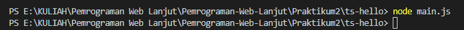

**Praktikum bagian 7: Classes**

**Main.ts**

~~~~~~~~~~~~~~~~~~~~~~~~~~~~~~~~~~~~~~~~~~~~~~~~~~~~~~~~~~~~~~~~~~~~~~~~~~~~~~~~
Class Pointku{
    x:number;
    y:number;
    draw(){
        *//...*
    }
    getDistance(another:Pointku){
        *//...*
    }
}
~~~~~~~~~~~~~~~~~~~~~~~~~~~~~~~~~~~~~~~~~~~~~~~~~~~~~~~~~~~~~~~~~~~~~~~~~~~~~~~~

**Main.js**

~~~~~~~~~~~~~~~~~~~~~~~~~~~~~~~~~~~~~~~~~~~~~~~~~~~~~~~~~~~~~~~~~~~~~~~~~~~~~~~~
Class Pointku{
    x: number;
    y: number;
    draw(){
        *//...*
    }
    getDistance(another, Pointku){
        *//...*
    }
}
~~~~~~~~~~~~~~~~~~~~~~~~~~~~~~~~~~~~~~~~~~~~~~~~~~~~~~~~~~~~~~~~~~~~~~~~~~~~~~~~

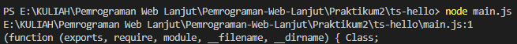

**Praktikum bagian 8 : Objects**

**Main.ts**

~~~~~~~~~~~~~~~~~~~~~~~~~~~~~~~~~~~~~~~~~~~~~~~~~~~~~~~~~~~~~~~~~~~~~~~~~~~~~~~~
class Pointku{
    a:number;
    b:number;
    draw(){
        console.log('X' + *this*.a + ',Y' + *this*.b);
    }
    getDistance(another:Pointku1){
        *//....*
    }
}
let coins:Pointku1

coins.draw();
~~~~~~~~~~~~~~~~~~~~~~~~~~~~~~~~~~~~~~~~~~~~~~~~~~~~~~~~~~~~~~~~~~~~~~~~~~~~~~~~

**Main.js**

~~~~~~~~~~~~~~~~~~~~~~~~~~~~~~~~~~~~~~~~~~~~~~~~~~~~~~~~~~~~~~~~~~~~~~~~~~~~~~~~
var Pointku = /** @class */ (function () {
    function Pointku() {
    }
    Pointku.prototype.draw = function () {
        console.log('X' + this.a + ',Y' + this.b);
    };
    Pointku.prototype.getDistance = function (another) {
        //....
    };
    return Pointku;
}());
var coins;
coins.draw();
~~~~~~~~~~~~~~~~~~~~~~~~~~~~~~~~~~~~~~~~~~~~~~~~~~~~~~~~~~~~~~~~~~~~~~~~~~~~~~~~

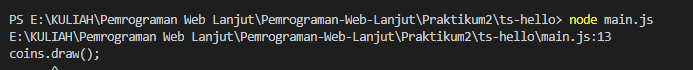
