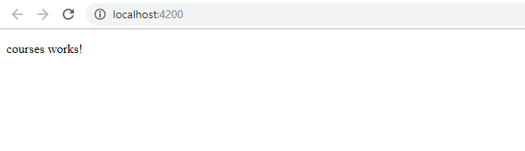
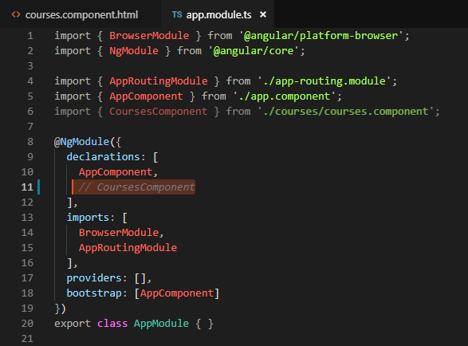
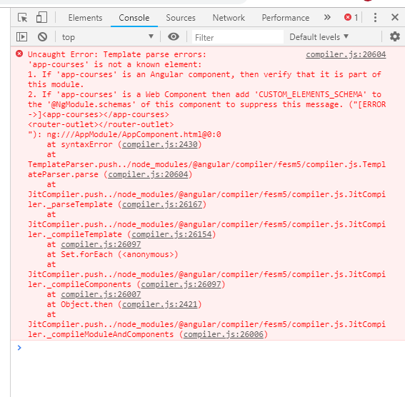
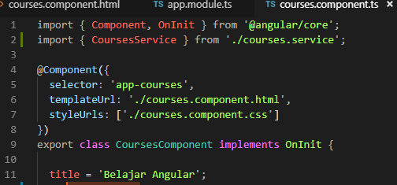
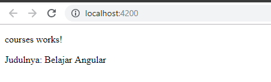
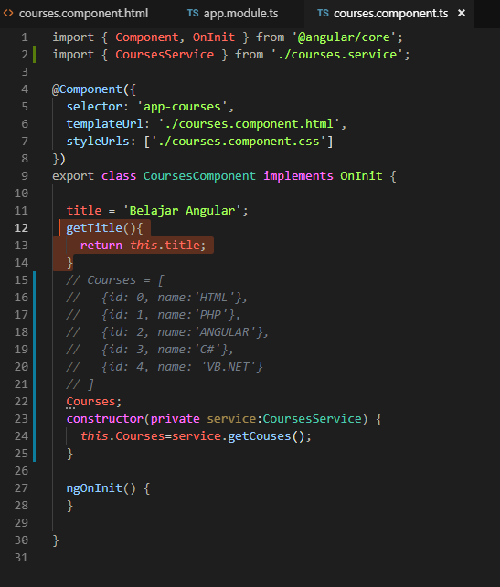
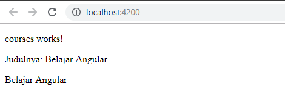
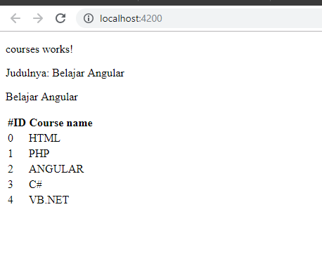
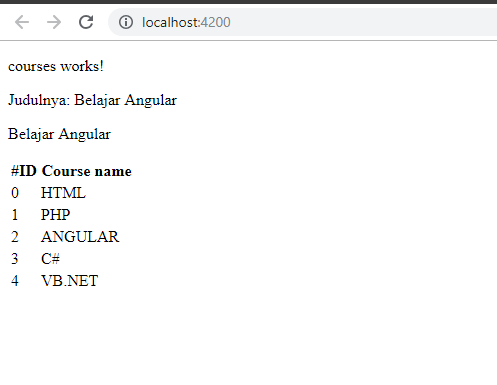

Jobsheet 3
==========

**Praktikum- Bagian 1: Component Basic**

1.  Melakukan modifikasi pada app.component.html
```
<app-courses></app-courses>
<router-outlet></router-outlet>
```

1.  Kemudian membukan terminal dan melakukan compile dengan perintah ng serve,
    dan berikut hasilnya:



1.  Memodifikasi app.module.ts dan menghapus cousecomponent



1.  Setelah dijalankan terjadi error karena componen app-course tidak dapat
    menemukan modulenya



**Praktikum – bagian 2 : Templates**

1.  Menambahkan property baru pada file courses.component.ts dengan nama title



1.  Lalu menambahkan String Binding pada courses.component.html
```
<p>
courses works!
</p>
<p>
{{"Judulnya: "+title}}
</p>
```
1.  Brikut hasil pada browser



1.  Menambahkan method getTitle() pada courses.component.ts



1.  Setelah itu juga menambahkan modifikasi pada courses.component.html, dengan
    menambah getTitle


1.  Dan hasil setelah menjalankan browser



**Praktikum – Bagian 3: Directive**

1.  Menambahkan array pada courses.component.ts
```
Courses = [
    {id: 0, name:'HTML'},
    {id: 1, name:'PHP'},
    {id: 2, name:'ANGULAR'},
    {id: 3, name:'C\#'},\
    {id: 4, name: 'VB.NET'}
]
```

1.  Lalu menambahkan table pada courses.component.html\

```
<table>
    <thead>
        <th>
        #ID
        </th>
        <th>Course name</th>
    </thead>
    <tBody>
        <tr *ngFor="let Course of Courses">
            <td>{{Course.id}}</td>
            <td>{{Course.name}}</td>
        </tr>
    </tBody>
</table>
```

1.  Lalu setelah decompile



**Praktikum- Bagian 4: Services dan Dependency Injection**

1.  Menambahkan method getCourse pada file couses.service.ts

```
getCouses(){
    return [
        {id: 0, name:'HTML'},
        {id: 1, name:'PHP'},
        {id: 2, name:'ANGULAR'},
        {id: 3, name:'C\#'},
        {id: 4, name: 'VB.NET'}
];
```

1.  Lalu melakukan modifikasi pada courses.component.ts

```
Courses;
constructor(private service:CoursesService) {
    this.Courses=service.getCouses();
}
```

1.  Hasil pada browser


