Jobsheet 4
==========

**Praktiikum-Bagian1:Component Basic**

1.  Menambahkan kode untuk kode binding

    

2.  Menambahkan code binding pada courses.component.html

    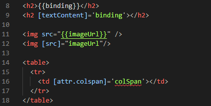

3.  Hasil di browser

    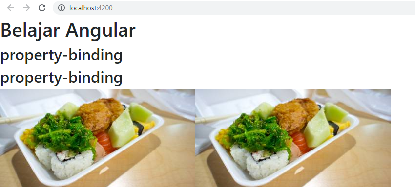

**Praktikum-Bagian2: Attribute Binding**

1.  Menambahkan colspan pada courses.component.ts

    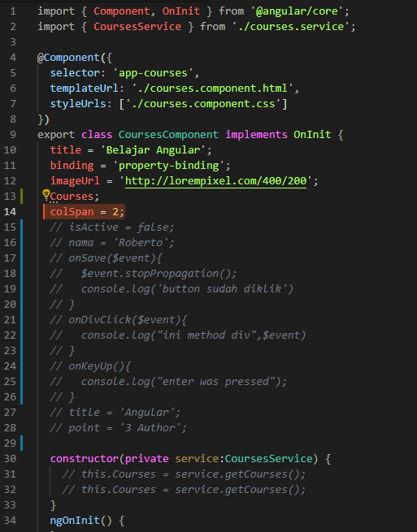

2.  Lalu padacouses.component.html ditambahkan table
```
<table>
    <tr>
        <td [colspan]='colSpan'\>\</td>
    </tr>
</table>
```
3.  Lalu inspect element dan mengecek error

    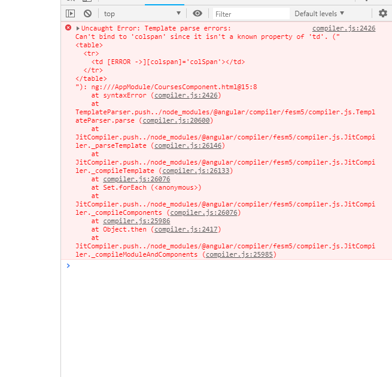

4.  Lalu pada colspan di tambahkan attr
```
    <table>
        <tr>
            <td [attr.colspan]='colSpan'></td>
        </tr>
    </table>
```
5.  Lalu menambahkan button pada courses.component.html
```
    <button type="button" class="btn btn-primary"
    [style.backgroundColor]="isActive? 'blue': 'white'" >Style</button>
```
6.  Menambahkan property isActive= true setelah line colSpan

    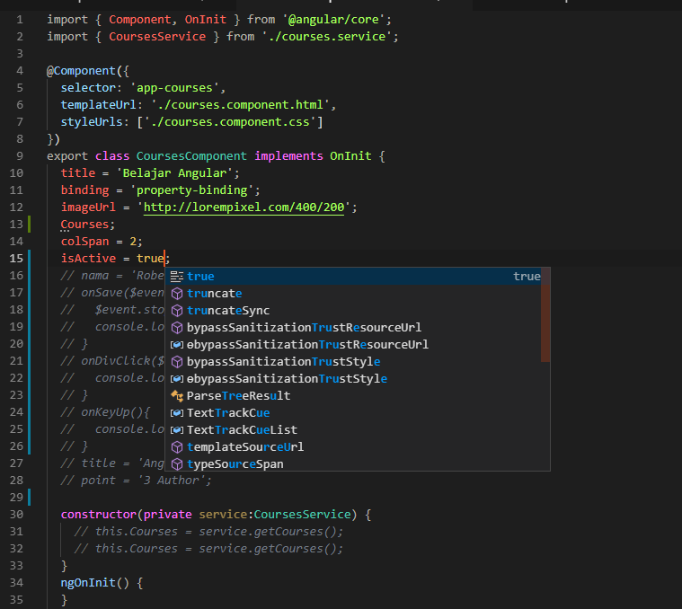

7.  Menambahkan data binding di html
```
    <body> ==$0
    <app-root _nghost-c0 ng-version="7.2.3">
    <app-courses _ngcontent-c0 _nghost-c1>
    <p _ngcontent-c1>
    </p>
    <table _ngcontent-c1>...</table>
    <h2 _ngcontent-c1>property-binding</h2>
    <h2 _ngcontent-c1>property-binding</h2>
    
    
    <table _ngcontent-c1>...</table>
    <button _ngcontent-c1 class="btn btn-primary active"
    type="button">tambah</button>
    </app-courses>
    </app-root>
    </body>
```
8.  Merubah isActive menjadi false

    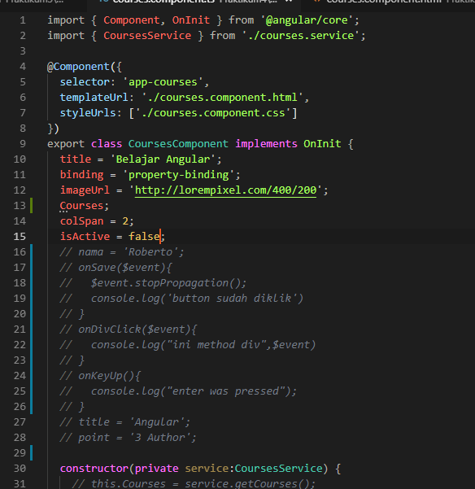

**Praktikum -Bagian 4:Style Binding**

1.  Menambahkan kode dengan style

    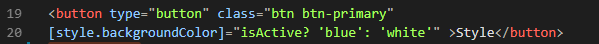

**Praktikum – bagian 5 : Event Binding**

1.  Menambahkan method onSave

    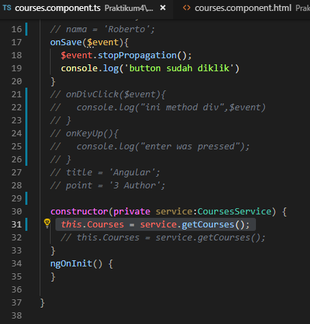

2.  Menambahkan component eventclick
```
    <button type="button" class="btn btn-default"
    (click)="onSave(\$event)">button</button>
```
3.  Hasil

    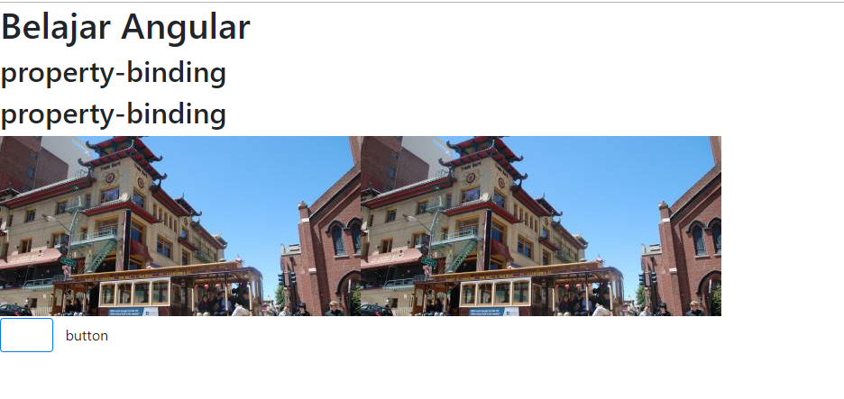

4.  Menambahkan parameter \$event
```
    onSave($event){
        $event.stopPropagation();
        console.log('button sudah diklik')
    }
```
5.  Menambahkan juga di html
```
    <button type="button" class="btn btn-default"
    (click)="onSave($event)">button</button>
```
6.  Menambahkan onDivClick() pasa course.component.ts
```
    onSave($event){
        $event.stopPropagation();
        console.log('button sudah diklik')
    }
    onDivClick($event){
        console.log("ini method div",\$event)
    }
```

7.  Menambahkan div dan event pada div element
```
    <div (click)="onDivClick$event)">
    <button type="button" class="btn
    btn-danger"(click)="onSave($event)">button</button>
    </div>
```
8.  Melakukan cek pada console inspect elemen

    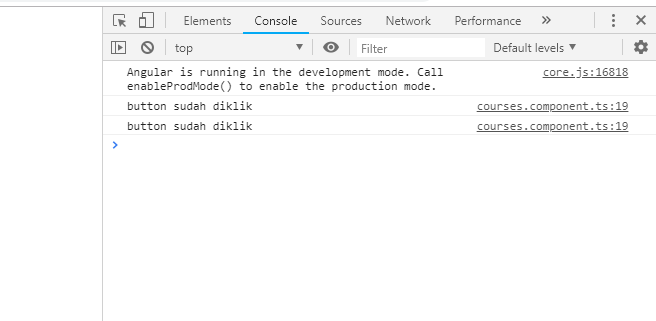

9.  Menambahkan $event.stopProprgation untuk mengatasi event bubbling
```
    onSave($event){
        $event.stopPropagation();
        console.log('button sudah diklik')
    }
    onDivClick($event){
        console.log("ini method div",$event)
    }
```
**Praktikum bagian 6: event filtering**

1.  Membuat inputan pada course Html
```
    <input type="text" [(ngModel)]="nama" (keyup.enter)="onKeyUp()">
```
2.  Menambahkan onekeyup
```
    onKeyUp(){
    console.log("enter was pressed");
    }
    title = 'Angular';
    point = '3 Author';
```
**Praktikum bagian 7:Template variable**

1.  Menambah variable nama
```
    <input type="text" [(ngModel)]="nama" (keyup.enter)="onKeyUp()">
```
2.  Menambah parameter nama
```
    onKeyUp(nama){
        console.log(nama);
        console.log("enter was pressed");
    }
```
**Praktikum bagian 8 : two way Binding**

1.  Membuat property baru dan menambah property nama
```
    nama = 'Roberto';
    onSave($event){
        $event.stopPropagation();
        console.log('button sudah diklik')
    }
    onDivClick($event){
        console.log("ini method div",$event)
    }
    onKeyUp(){
        console.log("enter was pressed");
    }

```
2.  Menambahkan parameter nama pada method onekeyup
```
    <input type="text" [value]='nama' (keyup.enter)="nama
    =$event.target.value;onKeyUp()">
```
3.  Menambah formmodule pada app.module.ts

    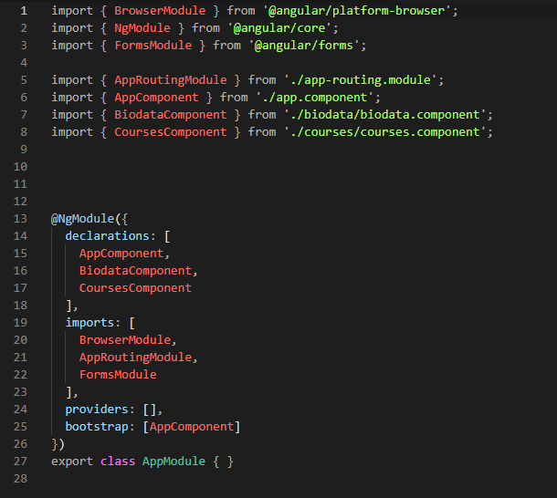

4.  Memodifikasi code pada couse.component.html
```
    <br><br>
    <input type="text" [value]='nama' (keyup.enter)="nama
    =$event.target.value;onKeyUp()">
    <input type="text" [(ngModel)]="nama" (keyup.enter)="onKeyUp()">
```