**Praktikum – Bagian 1: Building a Bootstrap Form**

| **Langkah** | **Keterangan**                                                                     |
|-------------|------------------------------------------------------------------------------------|
| 1           | Buat component baru dengan nama signup-form dengan perintah **ng g c signup-form** |
| 2           | Modifikasi file signup-form.component.html menjadi seperti berikut:                |
| 4           | Jalankan dan Catat hasilnya (soal 1)                                               |

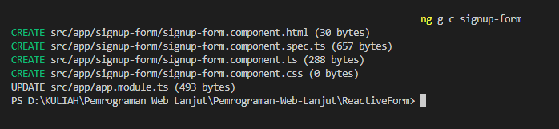

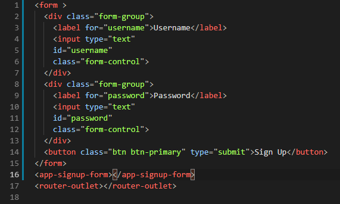

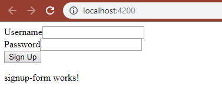

**Praktikum – Bagian 2: Control Programmatically**

| **Langkah** | **Keterangan**                                                                                          |
|-------------|---------------------------------------------------------------------------------------------------------|
| 1           | Modifikasi file signup-form.component.ts seperti dibawah ini:                                           |
| 2           | Modifikasi signup-form.component.html menjadi seperti berikut:                                          |
| 3           | Jalankan dan Catat hasil inspect elemen pada bagian console (soal 2), Akan muncul eror seperti berikut: |
| 4           | Modifikasi file app.module.ts tambahkan kode berikut:                                                   |
| 5           | Jalankan dan Catat hasilnya di bagian console pada browser (soal 3)                                     |

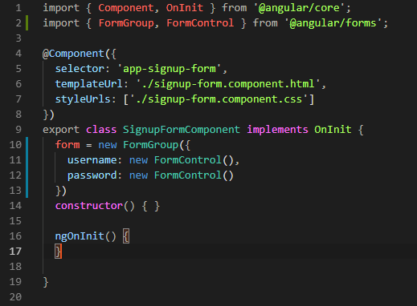

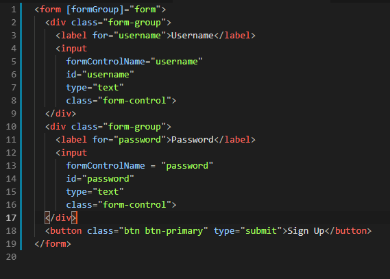

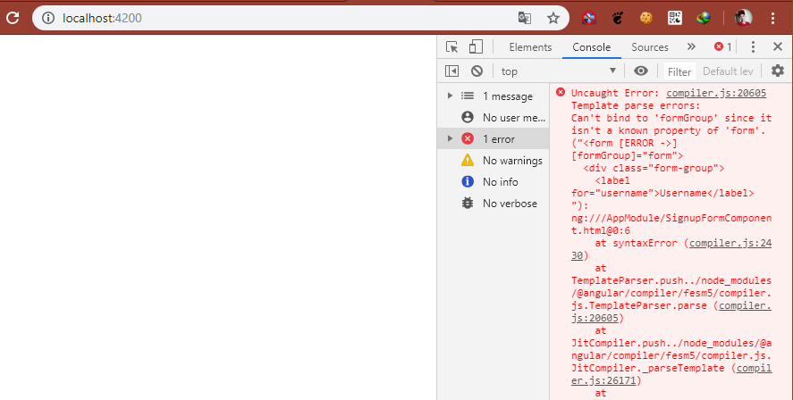

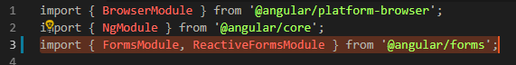

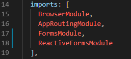

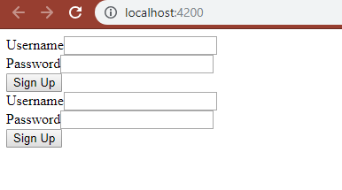

**Praktikum - Bagian 3: Adding Validation**

| **Langkah** | **Keterangan**                                                             |
|-------------|----------------------------------------------------------------------------|
| 1           | Modifikasi signup-form.component.ts menjadi seperti berikut:               |
| 2           | Modifikasi signup-form.component.html menjadi seperti berikut:             |
| 3           | Jalankan, apakah validasi formnya berfungsi dan Catat hasilnya (soal 4)    |
| 4           | Tambahkan get username pada file signup-form.component.ts seperti berikut: |
| 5           | Modifikasi file signup-form.component.html menjadi seperti berikut:        |
| 6           | Jalankan dan Catat hasilnya (soal 5)                                       |

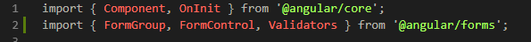

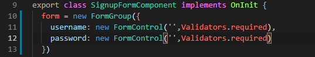

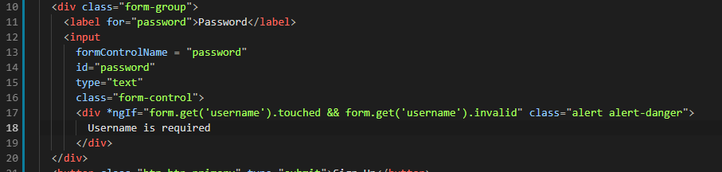

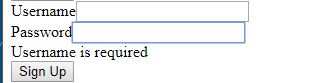

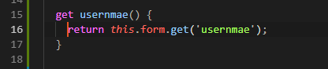

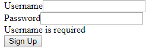

**Praktikum - Bagian 4: Specific Validation Errors**

| **Langkah** | **Keterangan**                                                 |
|-------------|----------------------------------------------------------------|
| 1           | Modifikasi signup-form.component.ts menjadi seperti berikut:   |
| 2           | Modifikasi signup-form.component.html menjadi seperti berikut: |
| 3           | Jalankan dan Catat hasilnya (soal 6)                           |
| 4           | Modifikasi signup-form.component.html menjadi seperti berikut: |
| 5           | Jalankan dan Catat hasilnya (soal 7)                           |

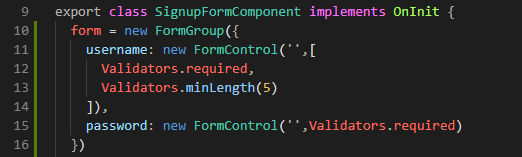

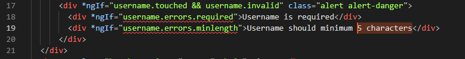

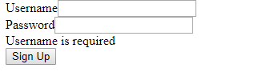

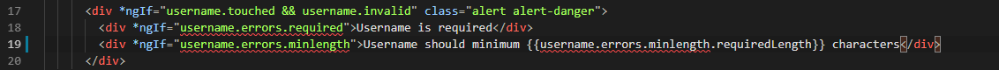

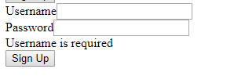

**Praktikum - Bagian 5: Custome Validation**

| **Langkah** | **Keterangan**                                                                                                       |
|-------------|----------------------------------------------------------------------------------------------------------------------|
| 1           | Buat file baru pada folder signup-form dengan nama **username.validators.ts** dan isi dengan script sebagai berikut: |
| 2           | Modifikasi signup-form.component.ts menjadi seperti berikut:                                                         |
| 3           | Modifikasi signup-form.component.html menjadi seperti berikut:                                                       |
| 4           | Jalankan dan Catat hasilnya (soal 8)                                                                                 |

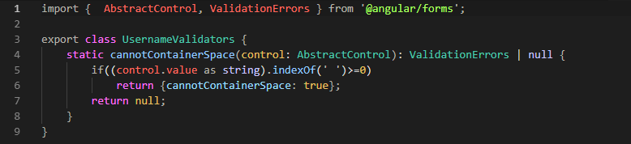

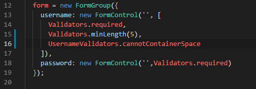

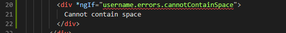

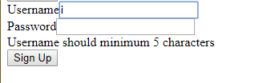

**Praktikum - Bagian 6: Asyncronus Validation**

| **Langkah** | **Keterangan**                                                            |
|-------------|---------------------------------------------------------------------------|
| 1           | Modifikas file username.validators.ts seperti berikut:                    |
| 2           | Modifikasi signup-form.component.ts menjadi seperti berikut:              |
| 3           | Modifikasi signup-form.component.html, tambahkan \<div\> seperti berikut: |
| 4           | Jalankan dan Catat hasilnya (soal 9)                                      |

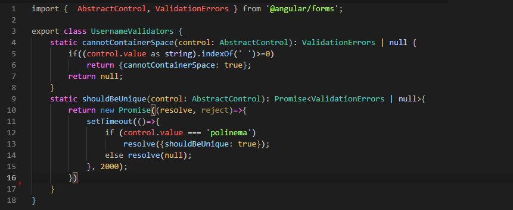

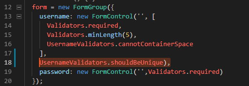

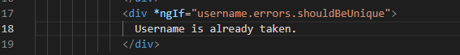

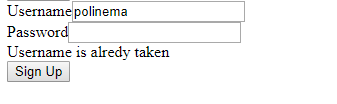

**Praktikum - Bagian 7: Displaying a Loader Image**

| **Langkah** | **Keterangan**                                                            |
|-------------|---------------------------------------------------------------------------|
| 1           | Modifikasi signup-form.component.html, tambahkan \<div\> seperti berikut: |
| 2           | Jalankan dan Catat hasilnya (soal 10)                                     |

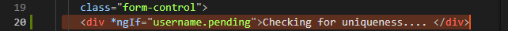

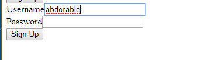

**Praktikum - Bagian 8: Validating Form on Submit**

| **Langkah** | **Keterangan**                                                                          |
|-------------|-----------------------------------------------------------------------------------------|
| 1           | Modifikasi signup-form.component.ts, dengan menambahkan method login() seperti berikut: |
| 2           | Modifikasi signup-form.component.html seperti berikut:                                  |
|             | Jalankan dan Catat hasilnya (soal 11)                                                   |

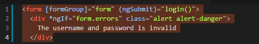

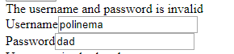
