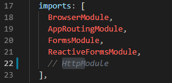

**Praktikum – Bagian 2: Getting Data**

1.  Membuat komponen baru dengan nama posts

1.  Import module HTTPServis

1.  Memodifikasi post.component.ts

1.  Memodifikasi app.component.html

1.  Hasil dari kode diatas

    

2.  Melakukan comment pada httpModule

    

3.  Yang terjadi adalah error, karena module http tidak diketahui

1.  Melengkapi kode program posts.component.ts

    

2.  Hasil dari modifikasi program diatas

    

3.  Menampilkan data pada browser dengan kode dibawah

    

4.  Mengubah kode pada posts.component.ts

    

5.  Hasil pada browser

    

**Praktikum – Bagian 3: creating data**

1.  Menambahkan input di elemen pada posts.component.html

    

2.  Memodifikasi program pada posts.componen.ts

    

3.  Hasil pada browser

    

**Praktikum – Bagian 4 : Updating Data**

1.  Menambahkan button update

1.  Menambahkan fungsi posts

    

**Praktikum 5 – Deleting Data**

1.  Menambahkan button delete

    

2.  Menambahkan fungsi delete

