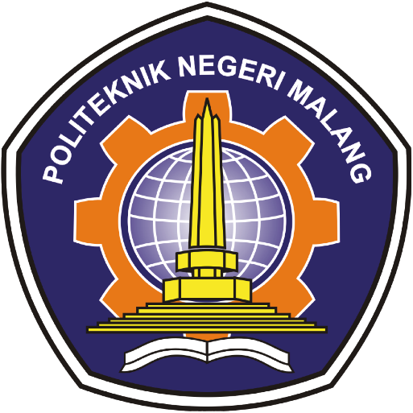

TUGAS PERORANGAN
================

Jobsheet Pemrograman Web Lanjut
-------------------------------

##### Disusun sebagai

##### MATA KULIAH: PEMROGRAMAN WEB LANJUT

##### Oleh:

##### **Rois Dwi Admaja/1741720193**

##### **TI – 2B / 24**

### PROGRAM STUDI: D-IV TEKNIK INFORMATIKA

### JURUSAN: TEKNOLOGI INFORMASI

### POLITEKNIK NEGERI MALANG

### 2019
