4.1 Component
-------------

-   Untuk menampilkan isi dari server.component.html maka buka file
    app.component.html dan tambahkan code berikut

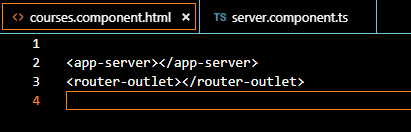

-   jika berhasil maka hasilnya seperti berikut

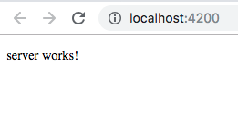

>   ../../../../../Users/dimaswahyu/Desktop/Screen%20Shot%202019-02-

-   buatlah juga sebuah component baru dengan nama **servers (ng generate
    component nama-component) atau (ng g c servers) “server pakai s”**

4.2 Component templateUrl dan template
--------------------------------------

-   buka file servers.component.ts modifikasi codenya menjadi seperti berikut

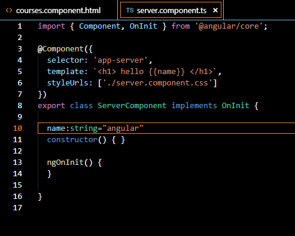

-   running (ng serve) maka hasilnya seperti berikut

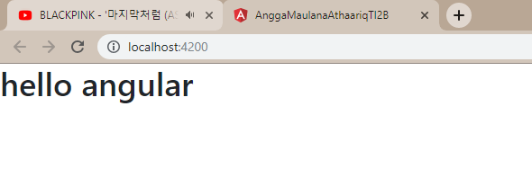

-   buka file server.component.ts (**default generate**)

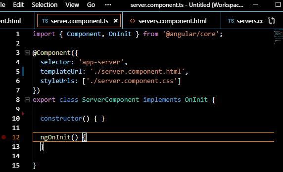

-   tambahkan code berikut pada server.component.html

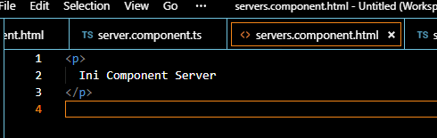

-   buka file app.component.html dan tambahkan component server agar terlihat
    perbedaannya

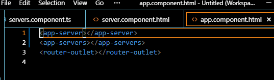

-   running dan hasilnya

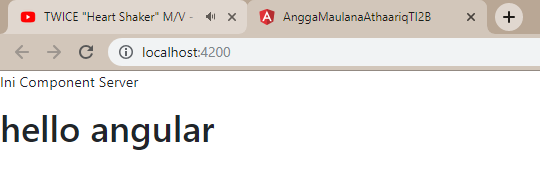

4.3 Component styles dan stylesUrl
----------------------------------

-   buka file app.component.html

    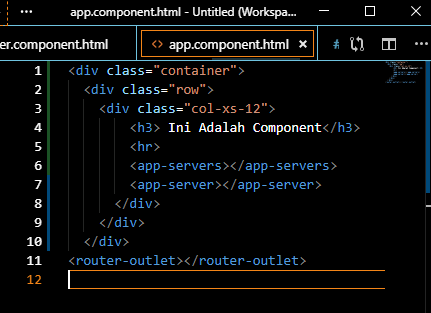

-   buka file app.component.css

    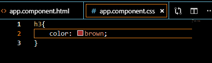

-   buka file server.component.ts dan tambahkan code berikut

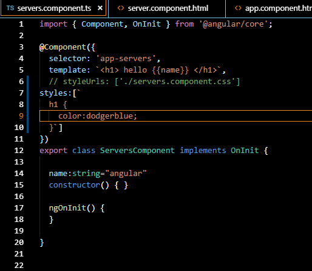

-   running hasilnya

    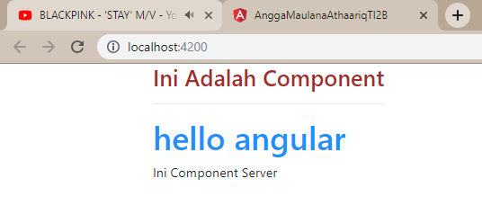

    1.  Component Selector

1.  selector custom prefix

-   buka server.component.ts

    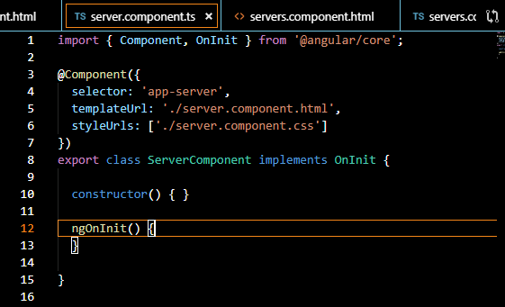

-   buka app.component.ts

    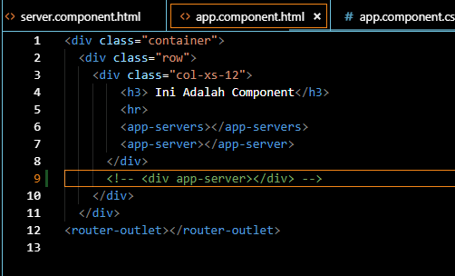

1.  Selector menggunakan square bracket / Directive custom prefix

-   buka file server.component.ts

    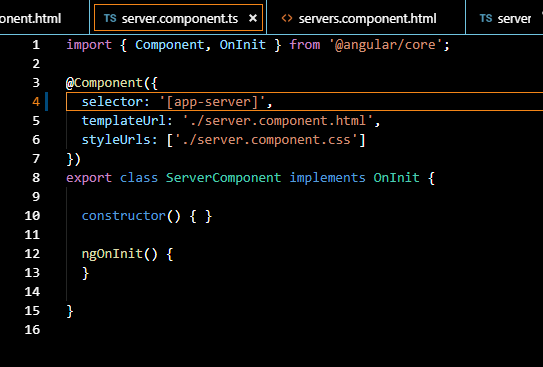

-   dan jalankan ng serve, maka akan terjadi error (**app-server is not a known
    element)**

    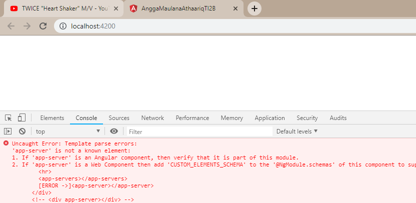

-   jika kita buka app.component.html maka akan ada error disana, maka pada
    app.component.html harus kita rubah menjadi seperti berikut

    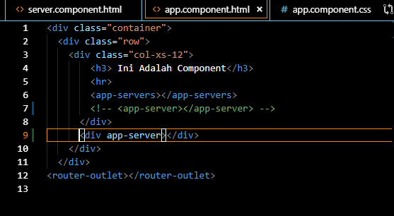

1.  selector menggunakan class

-   buka file server.component.ts rubah selector menjadi sebuah class, seperti
    berikut

    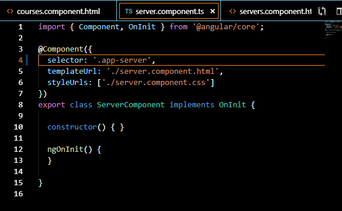

-   untuk memanggil selector class maka pada element kita tambahkan sebuah class
    seperti berikut

    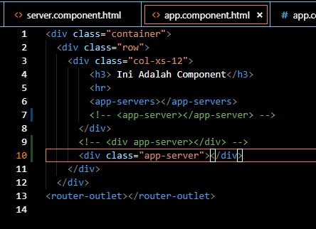

4.5 Component API
-----------------

-   buatlah sebuah component baru dengan nama **favorite (ng g c favorite)**

    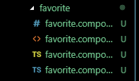

-   buka file app.component.ts dan buat sebuah property dengan nama post

    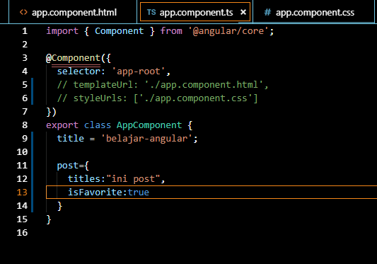

-   buka file app.component.html dan tambahkan code berikut (abaikan errornya
    terlebih dahulu)

    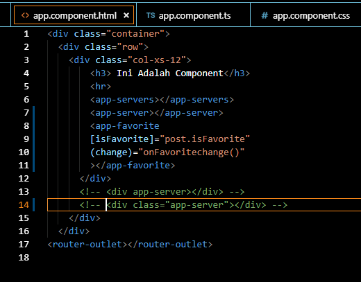

4.6 Input Properties
--------------------

-   jika sudah diinstal buka **angular.json** dan tambahkan style seperti
    berikut

-   buka file app.component.html dan modifikasi kodenya menjadi berikut

-   buka file favorite.component.ts tambahkan property dan sebuah function
    onClick seperti berikut

-   tambahkan decorator input

-   jika sudah jalankan localhostnya, jika benar maka akan muncul full star pada
    saat bintang diklik maka akan berubah menjadi empty star

    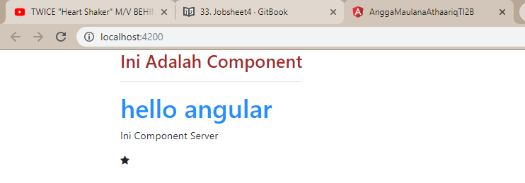

    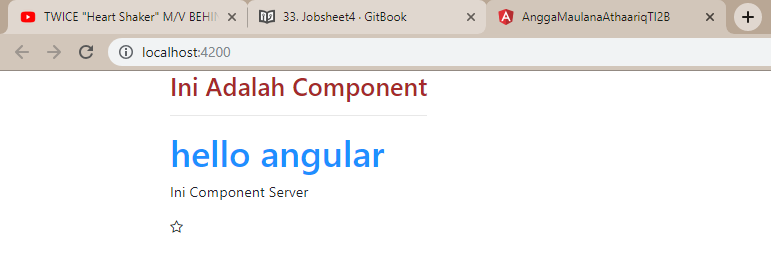

-   buka file favorite.component.ts modifikasi codenya menjadi berikut

    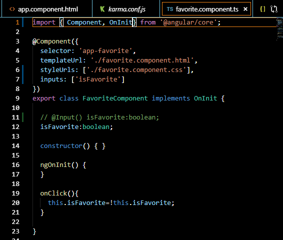

-   jalankan localhost maka hasilnya akan sama

    

    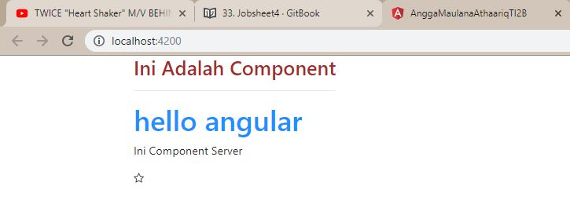

-   **select property isFavorite maka secara otomatis semua kata isFavorite akan
    ikut terseleksi**

    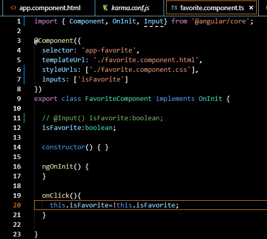

-   **tekan F2 maka akan muncul seperti berikut**

    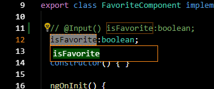

-   **ganti dengan kata coba**

    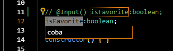

-   **lihat hasilnya jika kita lihat hasilnya yang berubah hanya dalam kelas
    FavoriteComponent saja sedangkan pada property input pada decorator
    component tidak ikut terubah**

    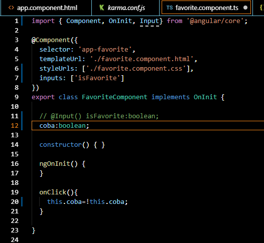

4.7 Aliasing Input Properties
-----------------------------

-   buka file favorite.component.ts tambahkan function onClickAlias() dan
    modifikasi codenya menjadi seperti berikut

    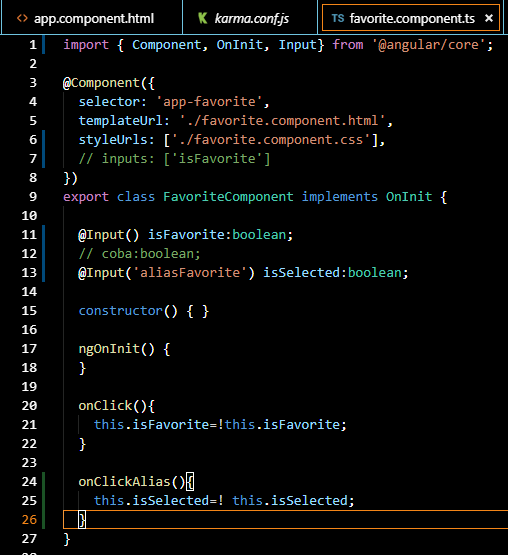

-   buka file favorite.component.css tambahkan code berikut

    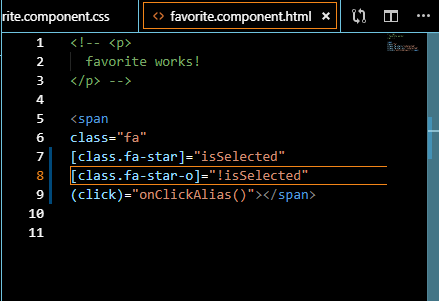

-   buka file app.component.html dan ganti input property yg sebelumnya
    [isFavorite] menjadi [aliasFavorite]

    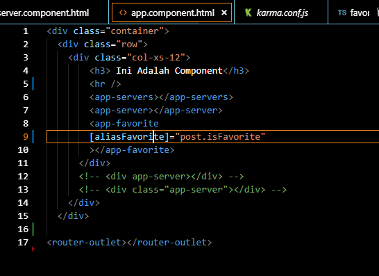

-   jalankan localhost maka hasilnya akan tetap sama dengan tanpa menggunakan
    alias

    

    

4.8 Output Properties
---------------------

-   buka file app.component.ts buatlah function onFavoriteChanged()

    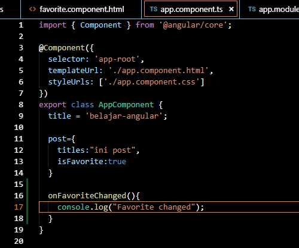

-   buka file app.component.html tambahkan output properties

    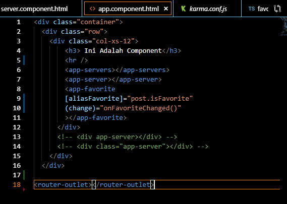

-   jika kita run localhost maka console tidak akan menampilkan sesuatu. Untuk
    itu kita membutuhkan decorator output

-   buka file favorite.component.ts tambahkan **decorator output** dan
    **emitEmiter** seperti berikut

    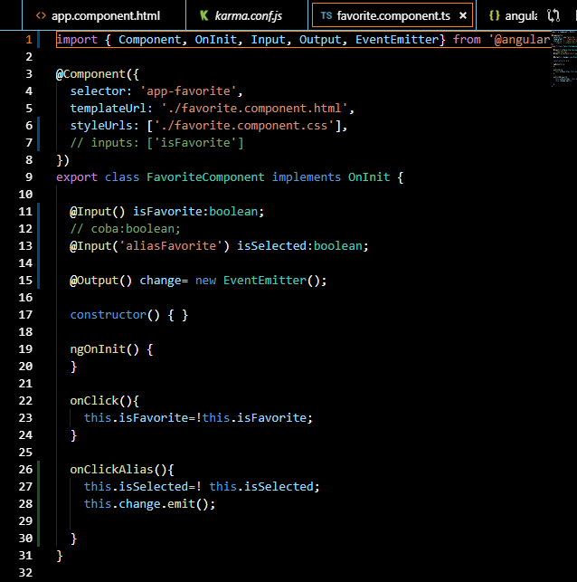

-   jalankan localhost dan buka console. Jika berhasil saat kita klik bintang
    maka akan muncul favorite change pada console

    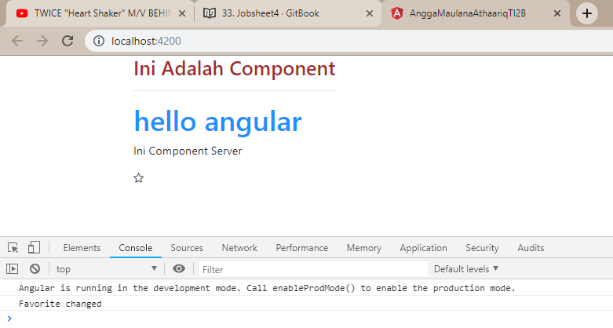

4.9 Passing Event Data
----------------------

-   Menggunakan cara pertama menggunakan dollar event object (\$event)

-   buka file favorite.component.ts

    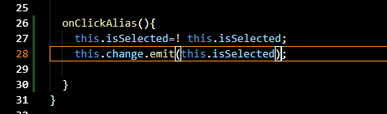

-   buka file app.component.ts

    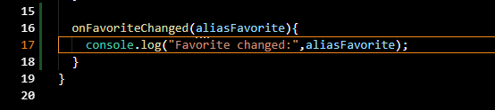

-   buka file app.component.html

    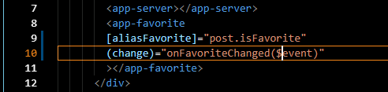

-   Jalankan localhost:4200 dan lihat hasilnya pada console, pada saat full star
    kita klik maka pada console akan menampilkan perubahan value (Boolean)

    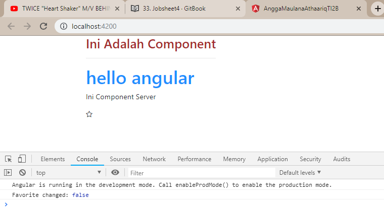

-   cara kedua menggunakan **instead pass object**. Object ini mempunyai
    property dengan nama **newValue** dan di set **this.isSelected** pada
    favorite.component.ts seperti berikut

    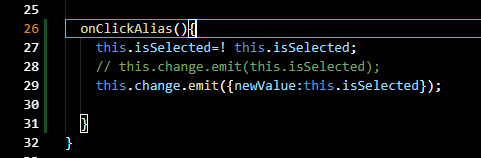

-   agar app.component dapat menerima value yang diberikan oleh
    favorite.component.ts maka parameter pada method onFavoriteChanged dirubah
    menjadi **eventArgs (Argument pass with event)** dan untuk menampilkan kita
    panggil eventArgs pada console log seperti pada gambar berikut

    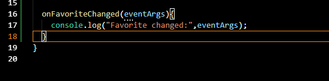

-   jalankan localhost:4200 lakukan perubahan menjadi empty star dan lihat pada
    console. Data yang dikirim berupa object bukan value seperti sebelumnya

    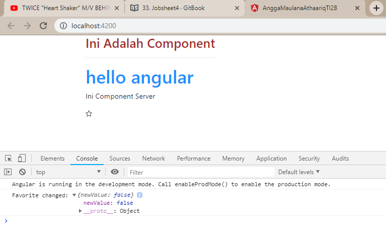

-   Cara ketiga menggunakan interface. buka file favorite.component.ts dan
    export sebuah interface dengan nama FavoriteChangeEventArgs dengan nama
    property newValue bertipe Boolean

    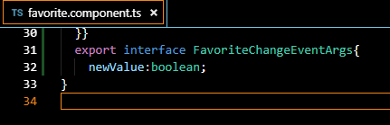

-   setelah itu buka file app.component.ts tambahkan pada parameter eventArgs
    sebuah alias interface dengan nama **FavoriteChangeEvent** (nama Interface
    yang telah dibuat pada favorite.component.ts

    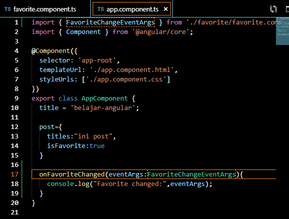

-   hasilnya akan sama dengan menggunakan instead pass object

    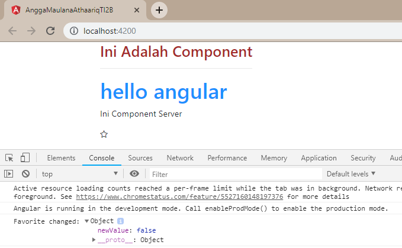

4.10 Aliasing Output Properties
-------------------------------

-   tambahkan **binding property name** pada **decorator output** pada
    favorite.component.ts

    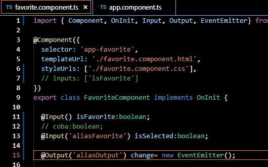

-   setelah kita tambahkan **binding property name** pada **decorator ouput**
    maka kita tambahkan juga pada **output properties** di
    **app**.**component**.**html**

    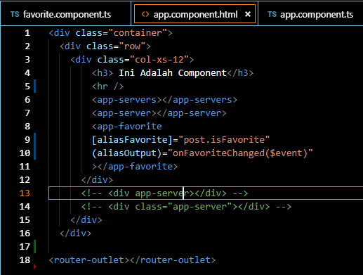

4.11 Templates
--------------

-   buka file favorite.component.html tambahkan code html

    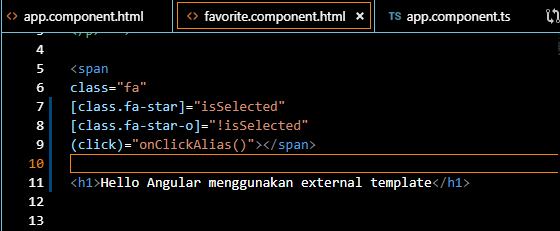

-   buka file favorite.component.html modifikasi codenya menjadi berikut

    

4.12 Styles
-----------

-   buka file favorite.component.html pastikan pada property pada decorator
    component terdapat **styleUrl**

-   buka file favorite.component.css tambahkan code berikut

    

-   run localhost:4200

    

-   buka file **favorite.component.ts** tambahkan **property styles**

    

-   run localhost maka hasilnya seperti berikut : (bintang berwarna hijau)

    
